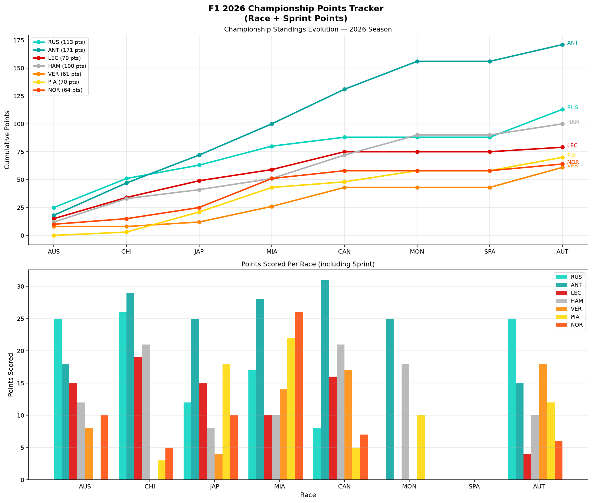

# F1 Championship Points Tracker

A Python tool that visualises the evolution of the Formula 1 Drivers 
Championship race by race, including both race and sprint race points, 
showing momentum shifts and title fight progression across the 2026 season.

## What it does

This script loads race and sprint race results from every 2026 Grand Prix 
and produces two charts:

- Cumulative points line chart — showing how the championship battle 
  evolved round by round with final points totals in the legend
- Points per race bar chart — showing exactly how many points each 
  driver scored at each individual Grand Prix including sprint bonuses

## Races Analysed

Australia, China (+ Sprint), Japan, Miami (+ Sprint), Canada (+ Sprint), 
Monaco, Spain, Austria (2026)

Note: Bahrain and Saudi Arabia excluded following cancellation due to 
the Iran conflict.

## Example Output

The 2026 championship analysis after 8 rounds shows Antonelli leading 
with 171 points, ahead of Russell on 131 and Hamilton on 125. Mercedes 
dominate the top three of the championship, with Verstappen, Piastri 
and Norris all significantly further back reflecting Red Bull and 
McLaren's struggles with the new 2026 regulations.

## Tech Stack

- Python
- [FastF1](https://github.com/theOehrly/Fast-F1) — official F1 timing and telemetry data
- Matplotlib — data visualisation
- Pandas — data handling
- NumPy — cumulative calculations

## How to Run

1. Install dependencies: `pip install fastf1 matplotlib pandas numpy`
2. Run the script: `python championship_tracker.py`
3. Chart will display and save as `championship_tracker.png`

## Why This Project

Championship trajectory analysis is fundamental to understanding team 
and driver performance trends across a season. Identifying which drivers 
score consistently versus those who peak at individual rounds informs 
long-term strategic planning for the remainder of the season.

## Author

Hamna Shahzad — Electrical Engineering Student | Aspiring Motorsport Engineer
